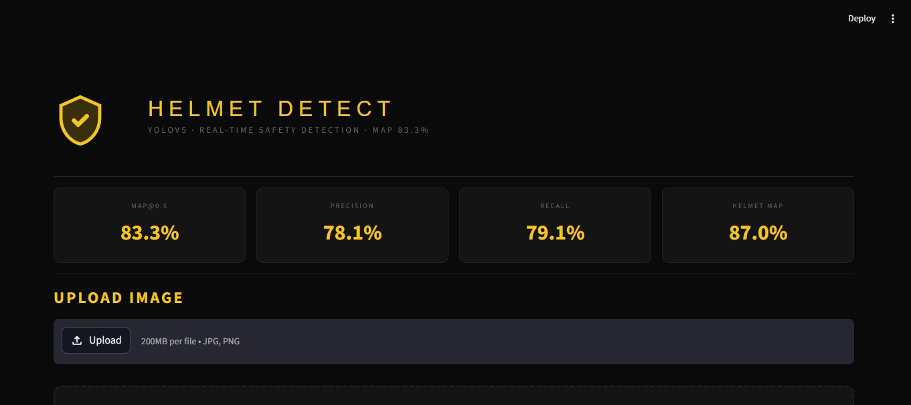
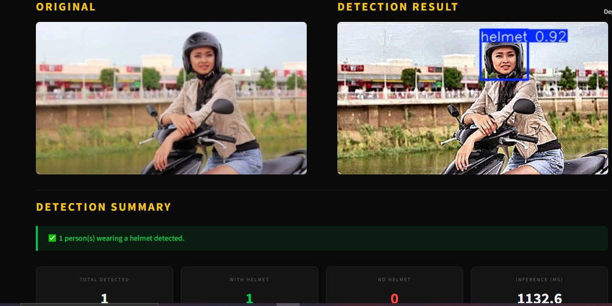

# 🪖 Helmet Detection Using YOLOv5

## 📌 Overview

This project is a real-time Helmet Detection System built using YOLOv5, OpenCV, and Streamlit.
The system detects whether a person is wearing a helmet or not from uploaded images.

---

## 🚀 Features

- Real-time helmet detection
- Detects:
  - ✅ Helmet
  - ❌ No Helmet
- Streamlit web interface
- YOLOv5 custom-trained model
- Image preprocessing for improved accuracy (CLAHE + Sharpening)
- Bounding box visualization with confidence scores

---

## 🖥️ Detection in Streamlit

- Upload any image (JPG/PNG) directly from your device
- Displays **Original** and **Detection Result** side by side
- Bounding boxes drawn around detected persons with class label and confidence score
- **Safety status alerts:**
  - ✅ Green alert when helmet is detected
  - ⚠️ Red alert when no helmet is detected
- Shows total count of helmet and no-helmet detections
- Displays **inference time** in milliseconds
- Per detection confidence badges for each detected object
- Clean dark-themed UI with model performance stats

---

## 📸 Demo

### App Interface


### Detection Result


---

## 🛠 Technologies Used

- Python
- YOLOv5
- PyTorch
- OpenCV
- Streamlit
- NumPy

---

## ⚙️ Installation

```bash
git clone https://github.com/iruventyuma/helmet-detection-yolo.git
cd helmet-detection-yolo
git clone https://github.com/ultralytics/yolov5
pip install -r requirements.txt
```

---
